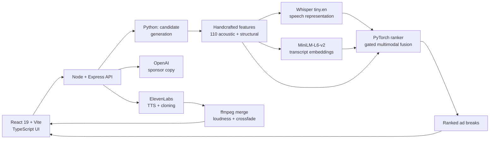

# Slotify

**Semantic and signal-aware ad insertion for audio.** Upload a podcast episode
or a song, and Slotify finds the best places for an ad to go, writes and voices
the sponsor read, and stitches it into the original audio with loudness matching
and crossfades.

UofTHacks 13 Winner — MLH Best Use of ElevenLabs.
[Video demo.](https://www.youtube.com/watch?v=S4m1lpipni0)

---

## What it does

An ad break in the wrong place is the difference between a listener tolerating a
sponsor read and skipping it. Slotify treats placement as a ranking problem
inside a single episode — of the couple hundred plausible cuts, which three are
best — and reads both the waveform and the transcript to answer it.

| Stage | What happens |
| --- | --- |
| **Analyze** | Candidate breakpoints generated from silence runs, pauses and RMS valleys, then ranked by a multimodal PyTorch model |
| **Preview** | Listen to the audio either side of a proposed cut before committing |
| **Generate** | Sponsor copy written for the product, then voiced — optionally in a cloned voice |
| **Merge / export** | Loudness-matched insertion with crossfades and ducking, via `ffmpeg` |

Placement analysis runs credential-free. API keys only unlock the copywriting
and voice halves, and `GET /api/capabilities` tells the UI exactly which
features the running deployment can offer.

## Architecture



| Component | Stack | Role |
| --- | --- | --- |
| `frontend/` | React 19, TypeScript, Vite | Upload → analyze → select → generate → export |
| `backend/src/` | Node, Express, TypeScript (`tsx`, no build step) | Product API, ffmpeg muxing, ElevenLabs and OpenAI calls |
| `backend/ad_inserter/` | Python, librosa, ffmpeg | Audio analysis and the insertion/mixing pipeline |
| `ml/src/slotify_rank/` | Python, PyTorch, transformers, sentence-transformers | Features, model, training, evaluation, product inference |

Each candidate becomes one multimodal record: 110 handcrafted acoustic and
structural scalars, a frozen Whisper speech representation, and a frozen MiniLM
embedding of the transcript either side of the cut. A gated fusion model
combines them, giving an unavailable modality exactly zero weight rather than a
zero vector. Product inference reuses the same feature code the training
pipeline uses, so training/serving skew is not expressible.

## Tech stack

| Area | Used for |
| --- | --- |
| **PyTorch** | The ranking model, the trainer, checkpointing |
| **Hugging Face `transformers`** | `openai/whisper-tiny.en` encoder for speech representations |
| **`sentence-transformers`** | `all-MiniLM-L6-v2` transcript embeddings |
| **librosa** | Spectral and onset descriptors in the handcrafted block |
| **scikit-learn / NumPy / SciPy** | Feature assembly, metrics, bootstrap resampling |
| **TypeScript, React 19, Vite** | The product frontend |
| **Node, Express** | The product API |
| **OpenAI** | Sponsor copy generation |
| **ElevenLabs** | Text-to-speech and voice cloning |
| **ffmpeg / ffprobe** | Decoding, loudness matching, crossfades, muxing |

## Run it locally

Requires Node.js >= 20, Python 3.12, and `ffmpeg` + `ffprobe` on `PATH`.

```bash
git clone https://github.com/davidyang07/slotify
cd slotify

# 1) Node workspaces
npm run install:all

# 2) The ML package (CPU-only)
cd ml && python -m venv .venv
.venv/Scripts/pip install -e ".[dev,label,features,sklearn]"   # Windows
# .venv/bin/pip install -e ".[dev,label,features,sklearn]"     # macOS / Linux
cd ..

# 3) Check your environment
npm run preflight

# 4) Run it
npm run demo
```

Then open <http://localhost:5173>, drop in an audio file, and click **Analyze**.

Optional keys in `backend/.env`:

| Variable | Unlocks |
| --- | --- |
| `OPENAI_API_KEY` | Sponsor copy and slot narration |
| `ELEVENLABS_API_KEY` | Voice cloning and TTS |
| `HUGGINGFACE_TOKEN` | `pyannote` diarization for two-speaker mode |

### Ranker modes

```bash
RANKER_MODE=auto       # default: the learned model when a checkpoint is configured
RANKER_MODE=learned    # require the model; fail loudly if it is unusable
RANKER_MODE=heuristic  # the frozen signal-based scorer, ~7 s per episode
```

### Scoring a file from the CLI

```bash
cd ml
python -m slotify_rank.cli infer rank \
  --audio ../backend/audio_tests/rogan-test1.mp3 \
  --checkpoint ../artifacts/training/gated-d8ed976101aa4c3b/best_checkpoint.pt \
  --top 3
```

### Tests

```bash
npm run verify:all     # frontend, backend, scripts and the ML suite
```

## Where things are

```text
.
├── backend/
│   ├── src/             # Express API: routes/, services/, lib/, middleware/
│   ├── ad_inserter/     # Python audio analysis + insertion pipeline
│   └── audio_tests/     # Sample audio for manual and CLI testing
├── frontend/src/        # React UI
├── ml/src/slotify_rank/ # Features, embeddings, models, training, inference, evaluation
├── config/              # The frozen signal-based scorer, shared by TS and Python
├── docs/                # Pipeline, dataset, training and demo documentation
└── scripts/             # preflight, demo, verify
```

## Documentation

| Document | What it covers |
| --- | --- |
| [`docs/feature-pipeline.md`](docs/feature-pipeline.md) | The multimodal feature pipeline |
| [`docs/model-training.md`](docs/model-training.md) | The training system |
| [`docs/model-inference.md`](docs/model-inference.md) | How a request becomes a learned ranking |
| [`docs/ad-inserter.md`](docs/ad-inserter.md) | The insertion pipeline, two-speaker modes and voice cloning |
| [`docs/demo-runbook.md`](docs/demo-runbook.md) | The 2-3 minute demo walkthrough |
| [`ml/README.md`](ml/README.md) | Every ML command |

## License

MIT. See [`LICENSE`](LICENSE).
