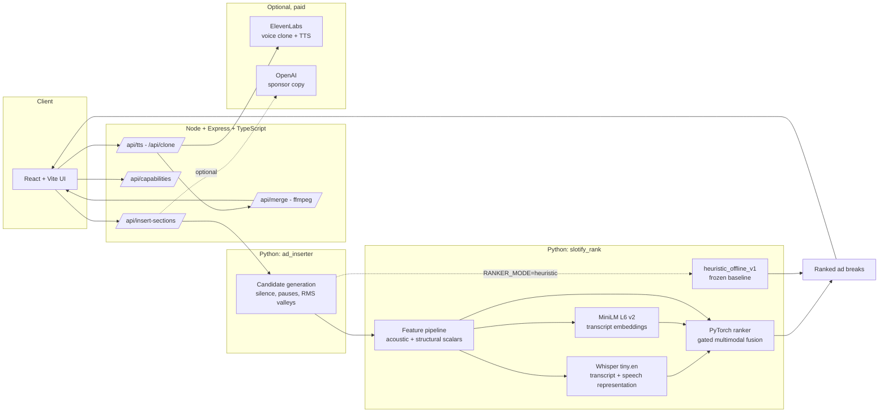

# Slotify

**A multimodal PyTorch ranker for podcast ad breaks, served through a working product.**

Upload an episode. Slotify finds the places an ad could go, ranks them with a
learned model that reads both the waveform and the transcript, and — if you give
it an ElevenLabs key — writes and voices a sponsor read and stitches it in with
loudness matching and crossfades.

UofTHacks 13 — MLH Best Use of ElevenLabs. (A sponsor prize, not the overall
hackathon award.)
[Video demo of the original hackathon build.](https://www.youtube.com/watch?v=S4m1lpipni0)

---

## What is actually interesting here

Finding an ad break is not a classification problem, it is a **ranking** problem
inside one episode, and the signal is genuinely multimodal: a two-second pause
is a good break if the topic also changed, and a bad one if the host is mid-
sentence and drew breath. So the system:

1. generates candidate breakpoints from the audio with deterministic signal
   rules (silence runs, pause detection, RMS valleys, transcript sentence ends);
2. builds a **multimodal feature vector** per candidate — 110 handcrafted
   acoustic and structural scalars, a frozen Whisper speech representation, and
   a frozen MiniLM embedding of the transcript either side of the cut;
3. **ranks** those candidates with a small PyTorch model trained on
   within-episode preference pairs;
4. measures itself against a frozen, credential-free heuristic baseline.

The second thing that makes this repository unusual is that it is built to make
a false quantitative claim hard to state. See
[Evaluation status](#evaluation-status).

---

## Architecture



Three languages, three responsibilities, and one rule between them: **candidate
generation is not ranking.** Generation is deterministic and signal-based and
always runs. Ranking is done either by the learned model or by the frozen
heuristic, and every response says which.

| Component | Stack | Role |
| --- | --- | --- |
| `frontend/` | React 19, TypeScript, Vite | Upload → analyze → select → generate → export |
| `backend/src/` | Node, Express, TypeScript (`tsx`, no build step) | Product API, ffmpeg muxing, ElevenLabs calls |
| `backend/ad_inserter/` | Python | Audio analysis and the insertion/mixing pipeline |
| `ml/src/slotify_rank/` | Python, PyTorch, transformers, sentence-transformers, librosa, scikit-learn | Dataset, features, model, training, evaluation, inference |
| `ml/src/slotify_rank/labelling/` | **FastAPI** + SQLite | The local human-labelling UI — *this* is where FastAPI is used |

**FastAPI does not serve the product API.** It hosts the local labelling tool
(`slotify-rank label serve`) where a human rates candidate breakpoints. The
product API is Express. Both are real; conflating them would misdescribe the
system.

---

## Quickstart

```bash
git clone https://github.com/davidyang07/slotify
cd slotify

# 1) Node workspaces
npm run install:all

# 2) The ML package (CPU-only; ~1 GB of wheels for the learned extras)
cd ml && python -m venv .venv
.venv/Scripts/pip install -e ".[dev,label,features,sklearn]"   # Windows
# .venv/bin/pip install -e ".[dev,label,features,sklearn]"     # macOS / Linux
cd ..

# 3) Check everything before you need it
npm run preflight

# 4) Run it
npm run demo
```

Then open <http://localhost:5173>, drop in an audio file, and click **Analyze**.

**No API keys are required for any of that.** Placement analysis, the learned
ranker and the heuristic baseline are all credential-free. Keys only unlock the
optional halves:

| Variable | Unlocks | Required? |
| --- | --- | --- |
| `ELEVENLABS_API_KEY` | Voice cloning, TTS, ad generation | No |
| `OPENAI_API_KEY` | Sponsor copy, slot narration | No |
| `HUGGINGFACE_TOKEN` | `pyannote` diarization for two-speaker mode | No |

`GET /api/capabilities` reports exactly what the running deployment can do, and
the UI disables what is unavailable instead of offering a button that fails.

### Ranker modes

```bash
RANKER_MODE=auto       # default: the learned model if a checkpoint is configured
RANKER_MODE=learned    # require the model; fail loudly if it is unusable
RANKER_MODE=heuristic  # the frozen offline baseline

SLOTIFY_RANKER_CHECKPOINT=artifacts/training/gated-d8ed976101aa4c3b/best_checkpoint.pt
```

`npm run demo` points `auto` at the committed bootstrap checkpoint. `npm run
demo -- --heuristic` forces the baseline, which is ~7 s per episode instead of
~45 s because it skips transcription.

---

## The learned ranker

`gated_v1`, 489,477 parameters, CPU-first. Three modality blocks are projected
to a common width and combined with learned gates; an unavailable modality gets
exactly zero weight rather than a zero vector the model could learn to read as a
value.

| Input block | Width | Source |
| --- | --- | --- |
| Handcrafted | 110 (+110 missing mask) | Multi-scale acoustic descriptors, structural position, generator provenance, `heuristic_offline_v1`'s component scores |
| Audio | 1536 | `openai/whisper-tiny.en` encoder states, mean-pooled over 4 windows (before, after, context, difference) |
| Text | 1536 | `sentence-transformers/all-MiniLM-L6-v2` on the transcript either side, plus their difference and elementwise product |

Trained on within-episode preference pairs with a ranking loss and an auxiliary
acceptability head, checkpoint-selected on validation NDCG@3, with train-only
feature normalization. Five variants (`handcrafted`, `text_only`, `audio_only`,
`concat`, `gated`) sit behind one interface so ablations are a config change.

Product inference reuses the *same* code the corpus pipeline uses — the upload
becomes a throwaway single-episode corpus and runs through the real Phase 3
stages — so a training/serving feature skew is not expressible.

```bash
# Score any audio file directly
cd ml
python -m slotify_rank.cli infer rank \
  --audio ../backend/audio_tests/rogan-test1.mp3 \
  --checkpoint ../artifacts/training/gated-d8ed976101aa4c3b/best_checkpoint.pt \
  --top 3
```

### The baseline

`heuristic_offline_v1` is the deterministic signal scorer that shipped in the
hackathon build, frozen. Its constants live in one language-neutral file
(`config/heuristic_offline_v1.json`) loaded by the TypeScript product, the Python
pipeline and the ML package, and CI regenerates a golden fixture from the
TypeScript and fails if it moved. It needs no key, no network and no GPU, so the
comparison denominator is reproducible by anyone.

---

## Evaluation status

This repository is deliberately built so that an unsupported number is hard to
state. Two generated reports are the authority; neither is written by hand.

```bash
npm run evidence          # what each capability's artifacts currently establish

cat artifacts/reports/model_evidence.md
```

Re-run those for current values. **Every number in this section is read from
those files, not typed here**, and the five quantities below are tracked
separately because collapsing them would overstate the work by an order of
magnitude:

| Quantity | What it is |
| --- | --- |
| **Generated candidates** | Timestamps the deterministic rules proposed. Not labels. |
| **Weak labels** | Targets derived from the baseline's own score. Circular as evidence. |
| **Human labels** | Someone listened and rated 1–5. The only supervised source the experiment accepts. |
| **Validation metrics** | Measured during development. Model selection may use them. Not the result. |
| **Held-out test metrics** | Measured once, at the end. This is the result. |

The checkpoint that ships is a **weakly supervised bootstrap**: its targets come
from `heuristic_offline_v1`'s own score, so it is a distillation of the baseline.
It proves the architecture and the serving path work end to end. It proves
nothing about ranking quality, and:

- every `/api/insert-sections` response it produces carries a warning saying so;
- `slotify-rank evaluation compare` **refuses to publish** an improvement
  computed from it, because comparing a distillation against its own teacher is
  circular;
- `artifacts/training/README.md` explains it in full.

The guard rails, all tested:

| Guard | Where |
| --- | --- |
| Weak labels are refused unless named on the command line | `datasets/labels.py` |
| The canonical experiment may declare `human` and nothing else as a label source | `experiment/canonical.py` |
| A headline improvement requires human ground truth, a human-trained model, the test split, the canonical baseline, and no episode overlap | `evaluation/compare.py` |
| The headline metric must agree with an independent implementation (`sklearn.metrics.ndcg_score`) or publication is blocked | `evaluation/crosscheck.py` |
| A zero baseline yields `None`, never an infinite improvement | `evaluation/compare.py` |
| An unmeasured metric renders `NOT YET AVAILABLE`; a measured zero renders `0` | `evaluation/evidence.py` |
| Blind consistency repeats are excluded from the label export, so a quality control cannot become supervision | `labelling/export.py` |
| Synthetic candidates can never be labelled, featurised or evaluated | `data/schema.py`, `pipeline/stages.py` |
| Normalization statistics are fitted on the train split only, and refuse others | `datasets/normalizer.py` |
| A partition holding fewer than three independent series fails the split outright, rather than warning | `data/splits.py` |
| The held-out partition holds the target format only, so the headline measures the product's task | `data/splits.py` |
| No single series may occupy more than half a partition's hours | `data/splits.py` |
| An episode no committed source registry declares is removed before it can be split, counted or labelled | `data/reconcile.py` |
| An open licence counts only when the show declared it in the show's own collection | `data/discover.py` |
| The product never invents a recommendation, a score or a reason | `backend/src/lib/`, `frontend/src/lib/` |

CI regenerates both reports from the committed artifacts and fails if either has
drifted — the one failure a generated report cannot catch by itself is being
true when written and not any more.

See [`docs/evaluation-evidence.md`](docs/evaluation-evidence.md) for the full
capability-to-artifact mapping and the experiment those claims are measured by.

### Running the experiment

```bash
cd ml
python -m slotify_rank.cli dataset prepare-experiment   # acquire → featurise → queue
python -m slotify_rank.cli label run-experiment             # the only manual step
```

The first command does everything mechanical and ends with a *measured*
readiness summary. The second pre-cuts every clip, says how many labels remain,
and opens the labelling UI; after it prints its banner the only remaining work is
human judgement. The protocol — split, seeds, baseline, metric, thresholds — is
fixed in advance in
[`ml/configs/experiment_v2.yaml`](ml/configs/experiment_v2.yaml)
and hashed into a manifest before the test split is read.

---

## Reproducing the tests

```bash
npm run verify                    # frontend lint + tests + build, backend typecheck + tests,
                                  # and the checkpoint-selection tests in scripts/

cd ml && python -m pytest         # the ML suite, network-free, no model downloads
cd ml && python -m pytest -m model_smoke -o addopts=""   # opt-in: downloads real weights
```

CI runs all of the above except model-smoke on every push, with no credentials.

---

## Where things are

```text
.
├── artifacts/           # GENERATED evidence: dataset, features, training, evaluation, reports
├── backend/
│   ├── src/             # Express API: routes/, services/, lib/, middleware/
│   ├── ad_inserter/     # Python audio analysis + insertion pipeline
│   └── audio_tests/     # Sample audio for manual and CLI testing
├── config/
│   └── heuristic_offline_v1.json   # The frozen baseline, in one place
├── docs/                # Runbook, evidence matrix, pipeline and labelling docs
├── frontend/src/        # React UI; lib/ holds the pure, tested logic
├── ml/
│   ├── configs/         # Versioned YAML for every stage
│   ├── src/slotify_rank/
│   │   ├── candidates/  # Generation + the Python port of the baseline
│   │   ├── data/        # Sources, manifests, splits, validation, statistics
│   │   ├── features/    # Acoustic, structural, transcript features
│   │   ├── embeddings/  # Whisper + MiniLM, cached
│   │   ├── datasets/    # Loader, normalizer, ranking views
│   │   ├── models/      # Five ranker variants behind one interface
│   │   ├── training/    # Trainer, checkpoints, reporting
│   │   ├── inference/   # Product-facing scoring (this is what the API calls)
│   │   ├── baselines/   # The scikit-learn classical comparison point
│   │   ├── evaluation/  # Metrics, held-out comparison, evidence reports
│   │   ├── labelling/   # FastAPI labelling UI + weak-label bootstrap
│   │   └── experiment/  # Canonical experiment, readiness gate, label freeze
│   └── tests/
└── scripts/             # preflight, demo, evidence
```

---

## Documentation

| Document | What it covers |
| --- | --- |
| [`docs/demo-runbook.md`](docs/demo-runbook.md) | The 2–3 minute demo walkthrough, with recovery paths |
| [`docs/evaluation-evidence.md`](docs/evaluation-evidence.md) | Every capability mapped to the artifact that supports or refutes it |
| [`docs/model-inference.md`](docs/model-inference.md) | How a request becomes a learned ranking |
| [`docs/model-training.md`](docs/model-training.md) | The training system |
| [`docs/feature-pipeline.md`](docs/feature-pipeline.md) | The multimodal feature pipeline |
| [`docs/dataset-card.md`](docs/dataset-card.md) | Corpus, licences, splits |
| [`docs/human-labelling-workflow.md`](docs/human-labelling-workflow.md) | The FastAPI labelling loop |
| [`ml/README.md`](ml/README.md) | Every ML command |

---

## The original insertion pipeline

The hackathon build's mixing and two-speaker features are unchanged and still
work. See [`docs/ad-inserter.md`](docs/ad-inserter.md) for the CLI flags,
two-speaker `A_ONLY`/`B_ONLY`/`DUO` modes, voice cloning and the `/ad/insert`
endpoint.

## Requirements

- Node.js ≥ 20
- Python 3.12 (the ML package pins `>=3.12,<3.13`)
- `ffmpeg` and `ffprobe` on `PATH`

## License

MIT. See [`LICENSE`](LICENSE).
