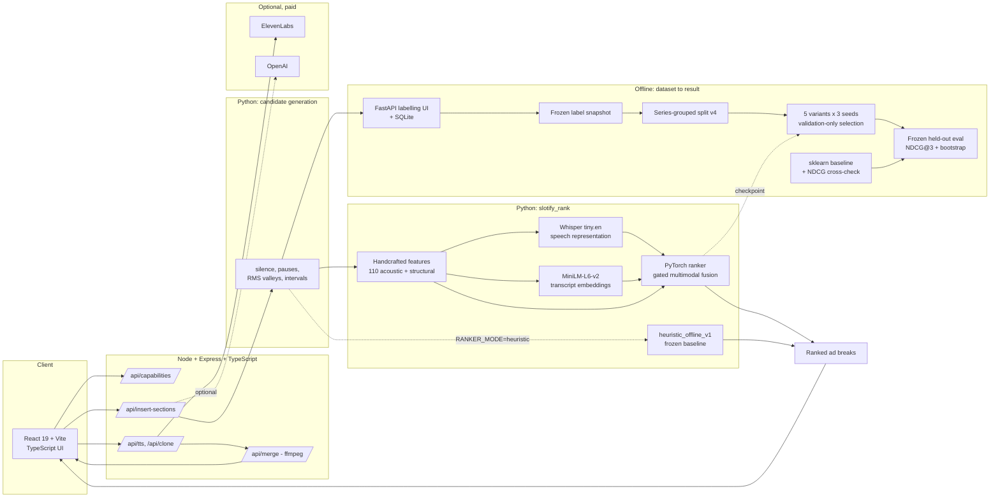

# Slotify

**A multimodal PyTorch ranker for podcast ad breaks, served through a working product.**

Upload an episode. Slotify finds the places an ad could go, ranks them with a
learned model that reads both the waveform and the transcript, and — if you give
it an ElevenLabs key — writes and voices a sponsor read and stitches it in with
loudness matching and crossfades.

UofTHacks 13 — MLH Best Use of ElevenLabs. (A sponsor prize, not the overall
hackathon award.)
[Video demo of the original hackathon build.](https://www.youtube.com/watch?v=S4m1lpipni0)

---

## 1. What Slotify does

An ad break in the wrong place is the difference between a listener tolerating a
sponsor read and skipping it. Slotify takes an audio file and answers one
question — *where should the ad go?* — then, optionally, writes the ad, voices
it, and performs the insertion.

The product half is complete and runs today, credential-free for the part that
matters:

| Stage | What happens | Needs a key? |
| --- | --- | --- |
| Analyze | Candidate breakpoints generated, then **ranked** by the learned model or the frozen baseline | No |
| Preview | Listen to the audio either side of a proposed cut | No |
| Generate | Sponsor copy written, then voiced (optionally in a cloned voice) | Yes |
| Merge / export | Loudness-matched insertion with crossfades and ducking, via `ffmpeg` | No |

## 2. The ranking problem

Finding an ad break is not a classification problem. It is a **ranking** problem
inside one episode: the question is never "is this second an ad break", it is
"of the two hundred plausible cuts in this episode, which three are best". And
the signal is genuinely multimodal — a two-second pause is a good break if the
topic also changed, and a bad one if the host is mid-sentence and drew breath.

So the system separates two things that are often conflated, and the separation
is the architectural rule everything else follows:

> **Candidate generation is not ranking.** Generation is deterministic,
> signal-based, and always runs. Ranking is done either by the learned model or
> by the frozen heuristic, and every response says which.

1. **Generate** candidate breakpoints from the audio with deterministic rules —
   silence runs, pause detection, RMS valleys, fixed intervals — then merge and
   density-cap them.
2. **Featurise** each candidate into one multimodal record: 110 handcrafted
   acoustic and structural scalars, a frozen Whisper speech representation, and
   a frozen MiniLM embedding of the transcript either side of the cut.
3. **Rank** with a small PyTorch model trained on within-episode preference
   pairs.
4. **Measure** against a frozen, credential-free heuristic baseline, on a
   held-out split no development decision has touched.

## 3. System architecture



| Component | Stack | Role |
| --- | --- | --- |
| `frontend/` | React 19, TypeScript, Vite | Upload → analyze → select → generate → export |
| `backend/src/` | Node, Express, TypeScript (`tsx`, no build step) | Product API, ffmpeg muxing, ElevenLabs calls |
| `backend/ad_inserter/` | Python | Audio analysis and the insertion/mixing pipeline |
| `ml/src/slotify_rank/` | Python, PyTorch, transformers, sentence-transformers, librosa, scikit-learn | Dataset, features, model, training, evaluation, inference |
| `ml/src/slotify_rank/labelling/` | **FastAPI** + SQLite | The local human-labelling UI — *this* is where FastAPI is used |

**FastAPI does not serve the product API.** It hosts the local labelling tool
(`slotify-rank label serve`) where a human rates candidate breakpoints. The
product API is Express. Both are real; conflating them would misdescribe the
system.

## 4. Dataset and feature pipeline

The corpus is **reconstructed, never stored**: `ml/configs/sources_v2.yaml` is a
committed registry of openly licensed episodes, and the pipeline re-acquires
them. No audio is committed beyond a handful of sample clips.

Measured state of the canonical corpus — every figure below is read from
`artifacts/dataset/` and `artifacts/features/`, not typed here:

| Quantity | Value |
| --- | --- |
| Processed episodes | 77 |
| Series (distinct shows) | 40 — of which **14 podcast**, 15 narrated, 11 conversational |
| Processed audio | 18.61 h, all target-domain |
| Generated candidates | 13,176 |
| Candidates with a complete multimodal record | 12,930 |
| Split | **v4**, grouped by **series**, seed 42, 70/15/15 |
| Series per partition | 30 train / 7 validation / 3 test, disjoint |
| Candidates per partition | 8,892 / 2,009 / 2,275 |

Every episode carries a declared open licence (Creative Commons, Public Domain
Mark, LibriVox dedication, or U.S. Government work), verified against the source
collection's own metadata rather than asserted.

The pipeline, all resumable and content-addressed so an interrupted stage picks
up where it stopped:

```
discover → import/fetch → probe → normalize → transcribe → candidates generate
        → acoustic features → audio embeddings → text embeddings → assemble
        → validate → split → statistics
```

| Feature block | Width | Source |
| --- | --- | --- |
| Handcrafted | 110 (+110 missing mask) | Multi-scale acoustic descriptors (librosa spectral and onset), structural position, generator provenance, `heuristic_offline_v1`'s own component scores |
| Audio | 1536 | `openai/whisper-tiny.en` encoder states, mean-pooled over 4 windows (before, after, context, difference) |
| Text | 1536 | `sentence-transformers/all-MiniLM-L6-v2` on the transcript either side, plus their difference and elementwise product |

See [`docs/feature-pipeline.md`](docs/feature-pipeline.md) and
[`docs/dataset-card.md`](docs/dataset-card.md).

## 5. Human labelling

Supervision comes from a person listening to a clip and rating the cut 1–5.
Everything around that is built, tested and running; the listening itself is a
**manual data-collection dependency**, not a missing piece of software.

What exists:

- a local **FastAPI + SQLite labelling UI** (`slotify-rank label serve`) built
  for speed: keyboard-driven, pre-cut clips, resumable across restarts;
- a deterministic **stratified queue** — `artifacts/labelling/queue_summary.json`
  records the built round: **2,400 unique candidates**, allocated 1,680 / 360 /
  360 across train / validation / test, balanced across score tertiles, position
  and silence buckets, capped per episode, and pinned by hash to a specific
  candidate manifest and split;
- **2,460 presentations**, because 60 candidates are shown a second time later
  in the session under a different, opaque presentation id with nothing in the
  payload marking them as a repeat — that is the intra-annotator agreement
  measurement, and those repeats are excluded from the export so a quality
  control can never become supervision;
- **no leakage into the annotator's judgement**: the served payload carries no
  heuristic score, no generator provenance, no split membership;
- **integrity checks** (`label check`) and an **immutable frozen snapshot**
  (`experiment freeze`) that hashes the labels, the candidates, the features and
  the split, and refuses to overwrite a version that already exists.

**Measured today: 0 human labels collected.** The queue is built; the round has
not been run. `artifacts/reports/claim_evidence.md` reports the queue size and
the label count as two different numbers and never adds them.

See [`docs/human-labelling-workflow.md`](docs/human-labelling-workflow.md),
[`docs/labelling-guide.md`](docs/labelling-guide.md) and
[`docs/pilot-labelling.md`](docs/pilot-labelling.md).

## 6. Training and evaluation protocol

The protocol is fixed in advance in
[`ml/configs/experiment_v2.yaml`](ml/configs/experiment_v2.yaml), committed
before the test split is read, and hashed into a manifest.

**Leakage safety.** The split groups on **series**, never on episode and never on
candidate: two episodes of one show share hosts, room, mic chain and vocabulary,
so an episode-level split would grade the model partly on memorisation. A
partition holding fewer than three independent series fails outright; no single
series may occupy more than half a partition's hours; and the test partition
holds the podcast format only, so the headline measures the product's actual
task. Normalisation statistics are fitted on train and refuse any other split.

**The ablation matrix.** Five variants behind one interface, three seeds each —
15 cells:

| Variant | Inputs |
| --- | --- |
| `handcrafted` | 110 scalars only |
| `text_only` | MiniLM transcript embeddings only |
| `audio_only` | Whisper speech representations only |
| `concat` | All three, concatenated |
| `gated` | All three, projected to a common width and combined with learned gates — an unavailable modality gets exactly zero weight rather than a zero vector the model could learn to read as a value. **This is the headline variant**, 489,477 parameters, CPU-first. |

**Selection.** Checkpoints are selected on **validation NDCG@3**. The reported
seed is the **median** of the three by validation NDCG@3, not the best —
reporting the best of several seeds is seed cherry-picking with extra steps.
Both rules are frozen in the experiment definition.

**Baselines.** Two, and only one is the denominator:

- `heuristic_offline_v1` — the **canonical baseline**, the deterministic scorer
  that shipped in the hackathon build, frozen. Its constants live in one
  language-neutral file (`config/heuristic_offline_v1.json`) loaded by the
  TypeScript product, the Python pipeline and the ML package, and CI regenerates
  a golden fixture from the TypeScript and fails if it moved.
- `classical_handcrafted_v1` — a scikit-learn `HistGradientBoostingRegressor` on
  the handcrafted scalars alone, tuned by `GroupKFold` **inside** the training
  split. Reported alongside, never as the denominator; it answers "would a good
  tabular model have done just as well?"

**The measurement.** NDCG@3, macro-averaged over test episodes, at cutoffs 1/3/5,
relevance threshold 4.0. Uncertainty is a percentile bootstrap over **episodes**
(2,000 resamples, 95%, seeded), because the episode is the unit of resampling.
Before any number is published it must agree with an independent implementation,
`sklearn.metrics.ndcg_score`, or publication is blocked.

See [`docs/experiment-protocol.md`](docs/experiment-protocol.md) and
[`docs/model-training.md`](docs/model-training.md).

## 7. Evidence architecture

This repository is built so that an unsupported number is hard to state. Two
generated reports are the authority; neither is written by hand, and CI
re-derives both from the committed artifacts and fails if either has drifted.

```bash
npm run evidence          # regenerate every statistic, then both reports
cat artifacts/reports/claim_evidence.md
cat artifacts/reports/model_evidence.md
```

`claim_evidence.md` separates two kinds of claim and never mixes them:

- **Implemented capability** — settled by committed code, the test that
  exercises it, and the artifact it produces. Currently **19 of 19 PASS**,
  covering the PyTorch ranker, Whisper, MiniLM, librosa, Transformers, the
  scikit-learn baseline and NDCG cross-check, candidate generation, multimodal
  preprocessing, the labelling round, label freezing, the grouped split, the
  ablation matrix, validation-only selection, bootstrap uncertainty, the
  reproducibility manifest, and the TypeScript product surface.
- **Empirical result** — settled only by a measurement. Currently **0 PASS**:
  no human labels exist, so no held-out NDCG@3 and no improvement has been
  measured. A PASS in the first table is never evidence for anything in the
  second.

Five quantities are tracked separately because collapsing them would overstate
the work by an order of magnitude:

| Quantity | What it is |
| --- | --- |
| **Generated candidates** | Timestamps the deterministic rules proposed. Not labels. |
| **Weak labels** | Targets derived from the baseline's own score. Circular as evidence. |
| **Human labels** | Someone listened and rated 1–5. The only supervised source the experiment accepts. |
| **Validation metrics** | Measured during development. Model selection may use them. Not the result. |
| **Held-out test metrics** | Measured once, at the end. This is the result. |

The checkpoint that ships is a **weakly supervised bootstrap**: its targets come
from `heuristic_offline_v1`'s own score, so it is a distillation of the baseline.
It proves the architecture and the serving path work end to end. It proves
nothing about ranking quality, and:

- every `/api/insert-sections` response it produces carries a warning saying so;
- `slotify-rank evaluation compare` **refuses to publish** an improvement
  computed from it, because comparing a distillation against its own teacher is
  circular;
- [`artifacts/training/README.md`](artifacts/training/README.md) explains it in
  full.

The guard rails, all tested:

| Guard | Where |
| --- | --- |
| Weak labels are refused unless named on the command line | `datasets/labels.py` |
| The canonical experiment may declare `human` and nothing else as a label source | `experiment/canonical.py` |
| A headline improvement requires human ground truth, a human-trained model, the test split, the canonical baseline, and no episode overlap | `evaluation/compare.py` |
| The headline metric must agree with `sklearn.metrics.ndcg_score` or publication is blocked | `evaluation/crosscheck.py` |
| A zero baseline yields `None`, never an infinite improvement | `evaluation/compare.py` |
| An unmeasured metric renders `NOT MEASURED`; a measured zero renders `0` | `evaluation/claim_evidence.py` |
| An implementation claim can never satisfy an empirical one | `evaluation/claim_evidence.py` |
| Blind consistency repeats are excluded from the label export | `labelling/export.py` |
| Synthetic candidates can never be labelled, featurised or evaluated | `data/schema.py`, `pipeline/stages.py` |
| Normalization statistics are fitted on the train split only, and refuse others | `datasets/normalizer.py` |
| A partition holding fewer than three independent series fails the split outright | `data/splits.py` |
| The held-out partition holds the target format only | `data/splits.py` |
| No single series may occupy more than half a partition's hours | `data/splits.py` |
| An episode no committed source registry declares is removed before it can be split, counted or labelled | `data/reconcile.py` |
| An open licence counts only when the show declared it in the show's own collection | `data/discover.py` |
| A committed cache, credential or corpus file fails the build | `scripts/lib/hygiene.mjs` |
| The product never invents a recommendation, a score or a reason | `backend/src/lib/`, `frontend/src/lib/` |

See [`docs/evaluation-evidence.md`](docs/evaluation-evidence.md) for the full
capability-to-artifact mapping.

## 8. Quick start

```bash
git clone https://github.com/davidyang07/slotify
cd slotify

# 1) Node workspaces
npm run install:all

# 2) The ML package (CPU-only; ~1 GB of wheels for the learned extras)
cd ml && python -m venv .venv
.venv/Scripts/pip install -e ".[dev,label,features,sklearn]"   # Windows
# .venv/bin/pip install -e ".[dev,label,features,sklearn]"     # macOS / Linux
cd ..

# 3) Check everything before you need it
npm run preflight

# 4) Run it
npm run demo
```

Then open <http://localhost:5173>, drop in an audio file, and click **Analyze**.

**No API keys are required for any of that.** Placement analysis, the learned
ranker and the heuristic baseline are all credential-free. Keys only unlock the
optional halves:

| Variable | Unlocks | Required? |
| --- | --- | --- |
| `ELEVENLABS_API_KEY` | Voice cloning, TTS, ad generation | No |
| `OPENAI_API_KEY` | Sponsor copy, slot narration | No |
| `HUGGINGFACE_TOKEN` | `pyannote` diarization for two-speaker mode | No |

`GET /api/capabilities` reports exactly what the running deployment can do, and
the UI disables what is unavailable instead of offering a button that fails.

### Ranker modes

```bash
RANKER_MODE=auto       # default: the learned model if a checkpoint is configured
RANKER_MODE=learned    # require the model; fail loudly if it is unusable
RANKER_MODE=heuristic  # the frozen offline baseline

SLOTIFY_RANKER_CHECKPOINT=artifacts/training/gated-d8ed976101aa4c3b/best_checkpoint.pt
```

`npm run demo` points `auto` at the committed bootstrap checkpoint. `npm run
demo -- --heuristic` forces the baseline, which is ~7 s per episode instead of
~45 s because it skips transcription.

### Scoring a file directly

```bash
cd ml
python -m slotify_rank.cli infer rank \
  --audio ../backend/audio_tests/rogan-test1.mp3 \
  --checkpoint ../artifacts/training/gated-d8ed976101aa4c3b/best_checkpoint.pt \
  --top 3
```

Product inference reuses the *same* code the corpus pipeline uses — the upload
becomes a throwaway single-episode corpus and runs through the real feature
stages — so a training/serving feature skew is not expressible.

### Running the experiment

```bash
cd ml
python -m slotify_rank.cli dataset prepare-experiment   # acquire → featurise → queue
python -m slotify_rank.cli label run-experiment         # the only manual step
```

The first command does everything mechanical and ends with a *measured*
readiness summary. The second pre-cuts every clip, says how many labels remain,
and opens the labelling UI; after it prints its banner the only remaining work
is human judgement.

## 9. Testing and CI

One command verifies everything that can be verified without collecting new
human labels:

```bash
npm run verify:all        # or: make verify
```

| Layer | What runs |
| --- | --- |
| `npm run verify` | frontend lint + tests + build; backend typecheck + tests; checkpoint-selection and hygiene tests in `scripts/` |
| `npm run verify:ml` | repository hygiene over the tracked tree; the ML suite; both evidence reports re-derived from the committed artifacts and compared; every implemented capability asserted; and — when a local corpus is present — dataset validation (25 checks, including split leakage by episode and by series), multimodal feature validation, labelling-queue integrity, label quality controls, and the experiment readiness gate |

Steps that need the uncommitted corpus report themselves as **skipped by name**
rather than passing silently.

```bash
cd ml && python -m pytest                                 # the ML suite alone
cd ml && python -m pytest -m model_smoke -o addopts=""    # opt-in: downloads real weights
```

CI runs all of the above except model-smoke on every push, with **no
credentials**: the baseline, the metrics, the dataset pipeline and the inference
contract are meant to be reproducible by anyone who clones the repository.
Anything needing Hugging Face weights lives in `model-smoke.yml` and is triggered
manually, so an upstream outage cannot turn an unrelated pull request red. A
separate job regenerates the baseline's golden fixture from the TypeScript
scorer and fails if the Python port has drifted from it.

## 10. Tech stack

| Area | Used for |
| --- | --- |
| **PyTorch** | The ranking model, its five variants, the trainer, checkpointing |
| **Hugging Face `transformers`** | `openai/whisper-tiny.en` encoder for speech representations |
| **`sentence-transformers`** | `all-MiniLM-L6-v2` transcript embeddings |
| **`openai-whisper`** *(optional)* | Local transcription for the semantic path |
| **librosa** | Spectral and onset descriptors in the handcrafted block |
| **scikit-learn** | The classical gradient-boosted baseline, `GroupKFold`, and the independent `ndcg_score` cross-check |
| **NumPy / SciPy** | Feature assembly, bootstrap resampling |
| **FastAPI + SQLite** | The local labelling UI and its resumable store |
| **TypeScript, React 19, Vite** | The product frontend |
| **Node, Express** | The product API |
| **ffmpeg / ffprobe** | Decoding, loudness matching, crossfades, muxing |
| **GitHub Actions** | Six jobs: frontend, backend, scripts, ml, corpus-registry, parity |

Each of these is verified in `artifacts/reports/claim_evidence.md` by three
independent facts — the dependency is declared, a committed module imports it,
and a generated artifact records it actually running. A dependency added to a
manifest and never used fails that check.

---

## Where things are

```text
.
├── artifacts/           # GENERATED evidence: dataset, features, labelling, training, evaluation, reports
├── backend/
│   ├── src/             # Express API: routes/, services/, lib/, middleware/
│   ├── ad_inserter/     # Python audio analysis + insertion pipeline
│   └── audio_tests/     # Sample audio for manual and CLI testing
├── config/
│   └── heuristic_offline_v1.json   # The frozen baseline, in one place
├── docs/                # Protocol, evidence matrix, pipeline, dataset and labelling docs
├── frontend/src/        # React UI; lib/ holds the pure, tested logic
├── ml/
│   ├── configs/         # Versioned YAML for every stage
│   ├── src/slotify_rank/
│   │   ├── candidates/  # Generation + the Python port of the baseline
│   │   ├── data/        # Sources, manifests, splits, validation, statistics
│   │   ├── features/    # Acoustic, structural, transcript features
│   │   ├── embeddings/  # Whisper + MiniLM, cached
│   │   ├── datasets/    # Loader, normalizer, ranking views
│   │   ├── models/      # Five ranker variants behind one interface
│   │   ├── training/    # Trainer, checkpoints, reporting
│   │   ├── inference/   # Product-facing scoring (this is what the API calls)
│   │   ├── baselines/   # The scikit-learn classical comparison point
│   │   ├── evaluation/  # Metrics, held-out comparison, evidence reports
│   │   ├── labelling/   # FastAPI labelling UI + weak-label bootstrap
│   │   └── experiment/  # Canonical experiment, readiness gate, label freeze
│   └── tests/
└── scripts/             # preflight, demo, evidence, claim-evidence, verify-ml, hygiene
```

## Documentation

| Document | What it covers |
| --- | --- |
| [`docs/experiment-protocol.md`](docs/experiment-protocol.md) | The benchmark experiment, end to end, for the operator running it |
| [`docs/evaluation-evidence.md`](docs/evaluation-evidence.md) | Every capability mapped to the artifact that supports or refutes it |
| [`docs/dataset-card.md`](docs/dataset-card.md) | Corpus, licences, splits |
| [`docs/feature-pipeline.md`](docs/feature-pipeline.md) | The multimodal feature pipeline |
| [`docs/human-labelling-workflow.md`](docs/human-labelling-workflow.md) | The FastAPI labelling loop |
| [`docs/labelling-guide.md`](docs/labelling-guide.md) | The 1–5 rubric an annotator applies |
| [`docs/pilot-labelling.md`](docs/pilot-labelling.md) | The controlled pilot round before the full queue |
| [`docs/model-training.md`](docs/model-training.md) | The training system |
| [`docs/model-inference.md`](docs/model-inference.md) | How a request becomes a learned ranking |
| [`docs/demo-runbook.md`](docs/demo-runbook.md) | The 2–3 minute demo walkthrough, with recovery paths |
| [`docs/ad-inserter.md`](docs/ad-inserter.md) | The original insertion pipeline and its two-speaker modes |
| [`ml/README.md`](ml/README.md) | Every ML command |

## The original insertion pipeline

The hackathon build's mixing and two-speaker features are unchanged and still
work. See [`docs/ad-inserter.md`](docs/ad-inserter.md) for the CLI flags,
two-speaker `A_ONLY`/`B_ONLY`/`DUO` modes, voice cloning and the `/ad/insert`
endpoint.

## Requirements

- Node.js ≥ 20
- Python 3.12 (the ML package pins `>=3.12,<3.13`)
- `ffmpeg` and `ffprobe` on `PATH`

## License

MIT. See [`LICENSE`](LICENSE).
